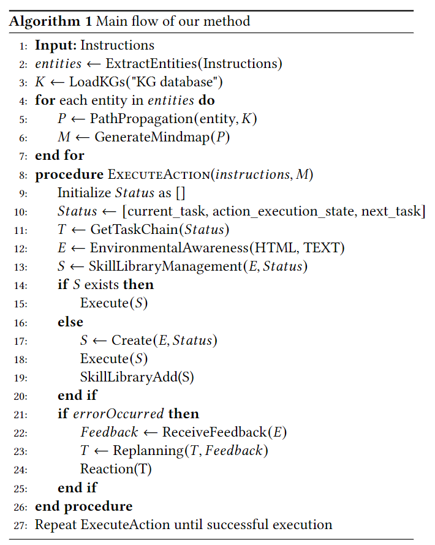

# Getting LLM to think and act like a human being: Logical path reasoning and Replanning

[[Arxiv]](xxx)
[[PDF]](xxx)
[[Videos]](xxx)

______________________________________________________________________

We introduce a Replanning mechanism for LLM-based agents that dynamically integrates feedback from actions and implicit information which not available in an initial thinking and reasoning framework, forming a bridge between the thinking and acting of LLMs. Compared to other agent methods, experiments conducted on real-life ticket booking websites such as Ctrip and Booking show that our method is more robust in executing clear instructions, capable of successfully completing more steps, and achieving a higher success rate in practical tasks such as ticket booking. especially in challenging tasks that require interactive thinking and action for LLMs.

  

# Innovations

 We propose three innovative mechanisms: implicit reasoning, Replanning, and Reaction, which make the following contributions:

1. Implicit reasoning based on logical path propagation, which integrates explicit and implicit information for reasoning, achieving a cognitive process closer to human-like thinking.

2. Replanning, a mechanism based on action feedback, allowing planning to dynamically integrate experiences from successful or failed actions, linking these isolated local optimal decisions for globally optimal Replanning.

3. Reaction and inductive deduction based on Replanning, which corrects erroneous actions and explores new actions while reassessing and correcting action strategies under a global information set, refining and preserving more general laws and strategies.

  

# Our method

The framework is based on three innovative components: logic path reasoning based on Knowledge Graphs (KG), single action process incorporating environmental feedback and skill management, and task chain management for implementing Replanning and Reaction.

  

1.The logic path reasoning:

  

2.The single action process component:

  

3.The task chain management:

  

# REFERENCES

We cite several key sources that contribute to the arguments and research field of the paper. Let's discuss the significance of some of these important references:

1. Abend and Rappoport (2017) provide an overview of semantic representation, which is crucial for understanding how LLMs process and interpret language. This foundational knowledge is essential for developing the Replanning mechanism.

2. Achiam et al. (2023) present the GPT-4 technical report, which is a significant LLM that serves as a basis for the research. Understanding the capabilities and limitations of GPT-4 is vital for developing mechanisms to improve LLM-based agents.

3. Ahn et al. (2022) discuss grounding language in robotic affordances, which is relevant to the authors' focus on integrating thinking and action in LLMs. This paper provides insights into how language models can be applied to real-world tasks and the challenges they face.

4. Brown et al. (2020) explore the few-shot learning capabilities of language models, which is an important aspect of the authors' research on Replanning. This paper highlights the potential of LLMs to learn from limited examples and adapt to new tasks.

5. Bubeck et al. (2023) discuss early experiments with GPT-4, providing further insights into the capabilities of this LLM. This reference helps to contextualize the authors' research within the broader field of LLM development.

6. Celikyilmaz et al. (2020) survey the evaluation of text generation, which is a key aspect of the authors' focus on improving LLM performance in complex tasks. This paper offers a comprehensive overview of the challenges and best practices in text generation.

7. Chang et al. (2023) provide a survey on the evaluation of large language models, which is directly relevant to the authors' research on enhancing LLM-based agents. This reference offers a critical analysis of the current state of LLMs and their performance in various tasks.

8. Chen et al. (2020) review knowledge reasoning over knowledge graphs, which is an important aspect of the authors' focus on integrating explicit and implicit information for reasoning. This paper provides insights into how LLMs can leverage knowledge graphs to improve their reasoning capabilities.

9. Chen et al. (2023) discuss the robustness of GPT-3.5 to text generation, which is a predecessor to the GPT-4 model used in the authors' research. This reference helps to establish a baseline for understanding the improvements made by the proposed Replanning mechanism.

